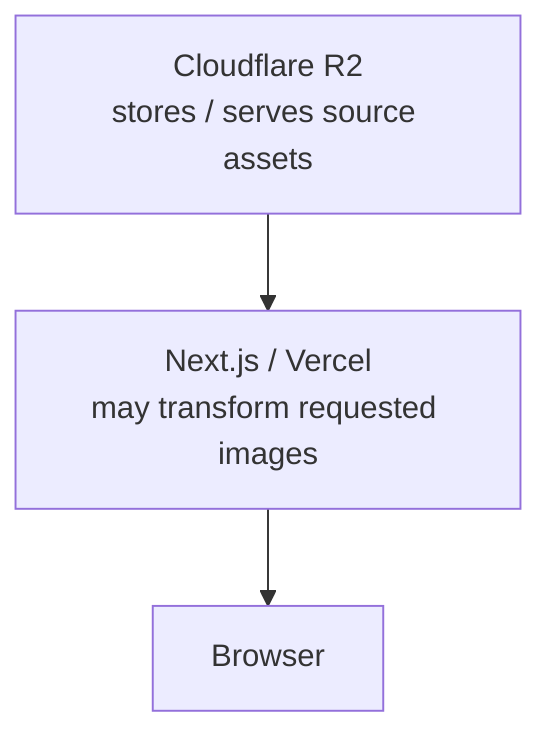
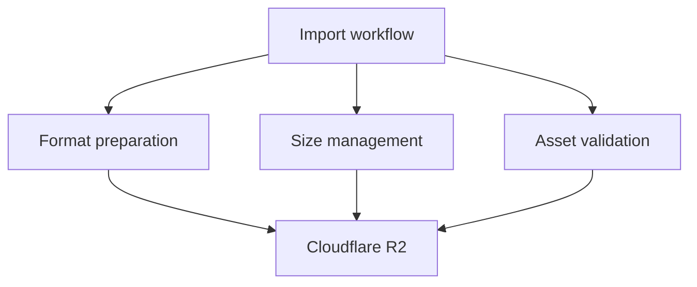
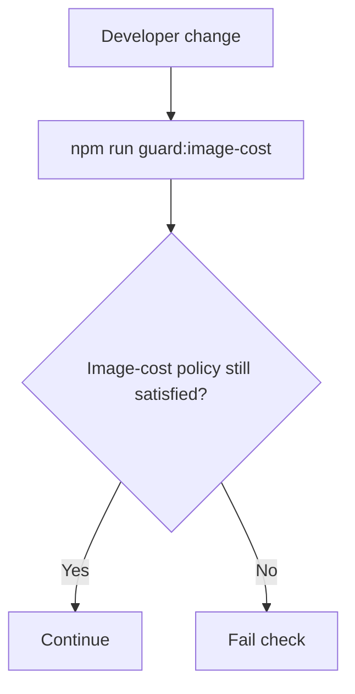
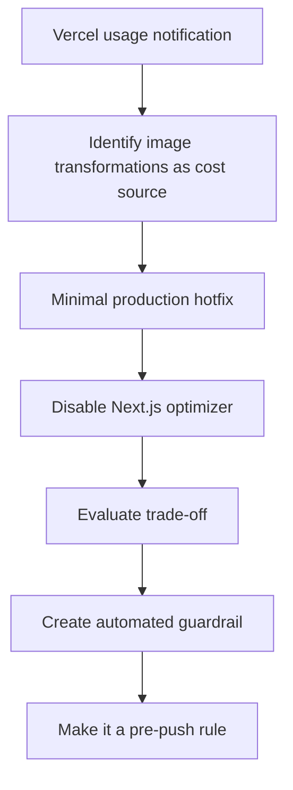

# Turning a Production Cost Incident into an Automated Guardrail

[Back to Engineering Case Studies](./README.md)

KK Archive is an image-heavy production application. Its media assets are primarily stored and delivered through Cloudflare R2, while the Next.js frontend is deployed on Vercel.

During production operation, I received a Vercel notification indicating that continued usage at the current level would require additional paid capacity.

The application itself had not crashed, and there was no functional bug.

The problem was operational:

> **Image transformation usage was creating a production cost risk that would continue growing with traffic and image requests.**

For an application whose primary workload involves displaying large numbers of images, this was not something I wanted to treat as a one-time billing inconvenience.

It was an infrastructure problem.

## Identifying the Cost Source

The relevant usage was associated with Next.js / Vercel **Image Optimization / Image Transformations**.

KK Archive already stored and served its image assets through Cloudflare R2.



The key question became:

> Does this application actually need Vercel to perform another image-transformation layer?

For KK Archive, I decided that it did not.

The application prioritizes stable delivery of a large image collection. Image format, sizing, and asset preparation can be handled earlier in the import pipeline or through storage-side asset management.

Continuing to perform request-driven transformations on Vercel added a variable cost that was not essential to the product.

## Applying a Minimal Production Hotfix

The first response was intentionally narrow.

I changed the Next.js configuration to disable the image optimizer globally:

```ts
images: {
  unoptimized: true
}
```

The corresponding commit was:

> `Hotfix: disable Next.js image optimizer to stop Vercel transformation costs`

The purpose of this commit was not to redesign the image pipeline.

It was to immediately stop the known source of transformation usage before it could continue accumulating.

This is why I treated it as a hotfix rather than combining it with unrelated refactoring.

## Understanding the Trade-off

Disabling the image optimizer solved the immediate cost problem, but it also removed features that Next.js / Vercel normally provides automatically.

These include:

- format conversion;
- compression;
- resizing;
- generation of optimized image variants.

That responsibility did not disappear. It moved.



For KK Archive, that trade-off was acceptable.

The application already depended on R2 for image storage and delivery, and predictable operating cost was more important than retaining an additional request-based transformation layer.

The decision can therefore be described as:

> **Moving image-optimization responsibility from a usage-sensitive runtime service into a controlled asset pipeline.**

## Why the Hotfix Was Not Enough

The configuration change fixed the immediate problem.

It did not prevent the problem from coming back.

The project still used `next/image`, and a future code change could accidentally re-enable paid transformations by:

- removing `images.unoptimized: true`;
- explicitly setting `unoptimized={false}`;
- changing image configuration without realizing the production cost implication.

In a rapidly iterated project, relying on memory was not strong enough.

Documentation alone was not enough either.

The repository needed to detect the regression automatically.

## Building an Automated Cost Guardrail

Approximately three minutes after the hotfix commit, I added a second change:

> `Add image-cost guardrails and pre-push check command`

This added a new command:

```bash
npm run guard:image-cost
```

and a dedicated validation script:

```text
scripts/check-image-cost-guardrails.mjs
```

The script checks the repository for conditions that could reintroduce the same cost behavior.

### Verifying the Global Configuration

The first check ensures that the Next.js configuration continues to include:

```text
images.unoptimized: true
```

If the setting disappears, the guardrail fails.

### Scanning Application Source

The script also scans application code under:

```text
app/
components/
```

One explicit failure condition is:

```tsx
unoptimized={false}
```

because that can opt an image back into transformation behavior even when the project is intended to avoid it.

When a violation is found, the script reports the problem and exits with a failure status rather than silently continuing.



## Turning the Check into a Development Rule

The guardrail is not only an optional debugging utility.

The repository's engineering instructions require it to be run before every push, and changes should not be pushed when the check fails.

That changed the protection mechanism from:

> “Remember not to enable the optimizer.”

into:

> **“Make the repository detect when the cost-risk configuration is reintroduced.”**

Humans forget. Fast-moving codebases change. Automated constraints are more reliable than relying on a developer to remember the details of an old production incident months later.

## Incident Timeline



The Git history preserves this sequence clearly: the production hotfix was followed almost immediately by the guardrail implementation.

## Why I Do Not Claim a Cost Reduction Percentage

I no longer have access to the historical Vercel usage window for this incident.

Because of that, I do not claim:

- a specific dollar amount saved;
- a percentage cost reduction;
- a measured transformation-count reduction.

The public evidence that remains verifiable is stronger in a different way:

- the production hotfix;
- the configuration change;
- the automated source/configuration scanner;
- the pre-push engineering rule.

Those artifacts show both the immediate response and the prevention mechanism.

## What I Learned

This incident reinforced that a production failure does not have to look like an exception or outage.

A system can be technically healthy while still having an unsustainable operational characteristic.

In this case, the failure mode was:

> **Cost scales with traffic in a way that is unnecessary for the application's architecture.**

The first responsibility was to stop the cost source.

The more important second responsibility was to make the same mistake harder to repeat.

The resulting pattern was:

```text
Detect operational risk
        ↓
Apply narrow mitigation
        ↓
Understand the trade-off
        ↓
Encode the constraint
        ↓
Automate regression detection
```

That pattern is now part of how I think about production maintenance.

## Evidence

- [Production hotfix — `859a2f7`](https://github.com/Mmc1xs/KK-Archive/commit/859a2f725889bf441cc68b3392ee6717c3278d96)
- [Guardrail commit — `2cc107a`](https://github.com/Mmc1xs/KK-Archive/commit/2cc107aa33f0be156973b65ff2f7db9fc42e32e0)
- [Guardrail source at the guardrail commit](https://github.com/Mmc1xs/KK-Archive/blob/2cc107aa33f0be156973b65ff2f7db9fc42e32e0/scripts/check-image-cost-guardrails.mjs)
- [Repository engineering rules at the guardrail commit](https://github.com/Mmc1xs/KK-Archive/blob/2cc107aa33f0be156973b65ff2f7db9fc42e32e0/AGENTS.md)
- [KK Archive repository](https://github.com/Mmc1xs/KK-Archive)
