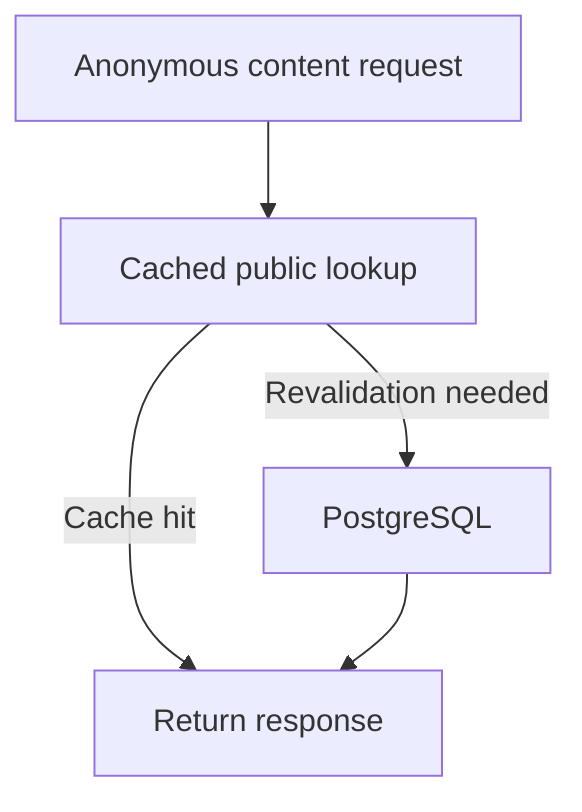
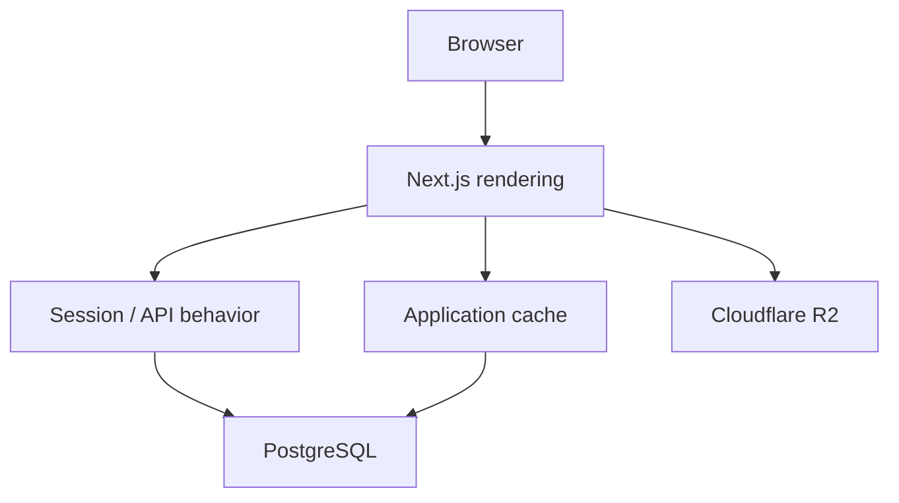

# Reducing Database and Request Pressure in a Production Next.js Application

[Back to Engineering Case Studies](./README.md)

KK Archive began as a rapidly evolving prototype. My initial priority was to make the core workflows functional: public content browsing, structured tag search, authentication, administration, file delivery, and publishing.

Once the application was running in production, however, one problem became difficult to ignore: **the site worked, but navigation was slow**.

Typical page loads took roughly five seconds, and browser activity showed that some interactions generated more requests than expected. I already knew the application needed performance work, but I initially lacked a clear way to identify where the unnecessary work was coming from.

A technical interview prompted me to revisit browser-side diagnostics with DevTools. Instead of treating the issue as simply “the website feels slow,” I began examining actual request behavior, repeated network calls, and opportunities for caching.

That changed the problem from a vague performance concern into a traceable engineering task.

## Investigating the Request Path

The first important finding was that there was no single slow function.

Several independent sources of unnecessary work existed across the request path.

One visible example was tag search. Entering text into the search interface could repeatedly trigger requests, even though many of those results were suitable for short-term caching.

Session handling was another area worth investigating. Public visitors did not necessarily need the same authentication-related work as signed-in users, yet session resolution could still influence public rendering behavior.

To understand the authentication path more clearly, I used Codex to map how session state traveled through the codebase. I then verified that map against the implementation and browser network activity.

The analysis identified several areas that could be improved independently:

- public rendering was coupled too closely to session resolution;
- public content lookups could use application-level caching;
- tag search results could avoid repeated database work;
- some relational queries could benefit from additional indexes;
- static objects in Cloudflare R2 could use explicit long-lived cache policies;
- runtime placement could be moved closer to the primary database region.

Rather than looking for one “performance bug,” I treated these as separate bottlenecks discovered during the same investigation.

## Separating Public Rendering from Session Resolution

One of the first architectural changes involved the root layout.

Previously, the layout performed server-side session work. This meant authentication state could influence rendering even when a visitor was only browsing public content.

I changed the navigation flow so that the root layout itself no longer needed to resolve the session directly. Navigation authentication state could instead be loaded separately through `/api/session`.

At the same time, the session endpoint remained explicitly dynamic and non-cacheable:

```http
Cache-Control: no-store
```

This separation allowed public data and authenticated state to follow different caching rules instead of forcing the public application shell into the same dynamic behavior.

## Caching Public Content

Public content is read far more often than it changes.

For anonymous content-detail requests, I added an application-level cached path using Next.js caching with a 120-second revalidation window.



Authenticated behavior could continue using the normal uncached path where necessary, while common public traffic could avoid repeating the same database query for every visitor.

This was an important design distinction: I did not want to cache everything indiscriminately. I wanted public, relatively stable data to be cacheable without changing the correctness requirements of authenticated flows.

## Making Tag Search Cache-Aware

The tag-search API was another high-frequency candidate.

Its responses were updated to use:

```http
Cache-Control: public, s-maxage=120, stale-while-revalidate=600
```

The tag-query implementation also gained an application-level cached path when the request did not contain exclusions that made the result more specific.

This accepts a small amount of temporary staleness for public tag metadata in exchange for fewer repeated computations and database queries.

For this type of search data, that trade-off was reasonable: a tag result being briefly behind the newest database state was less harmful than recomputing identical results for every request.

## Improving Database Access

The same investigation exposed query patterns that included both a parent content identifier and a display order.

Indexes were added for combinations such as:

```text
(contentId, sortOrder)
```

on related content tables.

These indexes matched common retrieval patterns more closely and reduced the need for the database to repeatedly sort or search through related records without an appropriate index.

This was not a dramatic architectural rewrite. It was a smaller example of the same principle:

> Optimize the actual access pattern rather than the abstract schema.

## Reducing Geographic and Storage Overhead

Application execution was also configured to prefer the `hkg1` region for several public-facing routes.

The goal was to reduce avoidable distance between application execution and the primary database environment.

Cloudflare R2 uploads were given explicit cache metadata:

```http
Cache-Control: public, max-age=31536000, immutable
```

for assets whose object keys are treated as immutable.

Because those files do not change in place, long-lived browser and CDN caching is appropriate.

The R2 S3 client was also reused through a global singleton instead of constructing a new client unnecessarily.

Together, the changes addressed multiple parts of the request path:



The performance problem was therefore not solved by a single caching feature. It was improved by reducing repeated work at several layers.

## Results

After the optimization pass, the typical page load time I observed dropped from approximately:

> **5 seconds to 1 second**

That represents roughly an **80% reduction in page load time**.

During the same period, the Vercel production dashboard showed approximately:

> **35% fewer Function Invocations**

Tag-search responsiveness also improved, although its usage volume was not high enough for me to claim a meaningful standalone percentage improvement.

These measurements were observed during the optimization period. The historical Vercel dashboard window is no longer available, so I treat the figures as recorded production observations rather than currently reproducible benchmark evidence.

The underlying implementation changes remain publicly verifiable in Git history.

## Turning the Findings into Engineering Guardrails

The same change set also introduced repository-level performance and security rules.

Among them:

- keep public pages cache-friendly;
- avoid making the entire application dynamic only to read session state;
- scope session reads to the routes and components that need them;
- maintain indexes for frequent filters and ordering patterns;
- keep search/filter APIs lightweight and cache-aware;
- place runtime execution close to the database where practical;
- define explicit cache policies for immutable storage assets;
- observe route-level latency before adding heavier functionality.

For me, that was the more important outcome.

The original prototype was optimized primarily for iteration speed. Production use exposed where those decisions created unnecessary work.

The solution was not to stop prototyping. It was to add a second phase:

> **Prototype quickly, observe real behavior, identify bottlenecks, and harden the parts that production traffic exposes.**

## Evidence

- [Performance commit — `bc1ba808`: reduce dynamic load and cache public content/tag search](https://github.com/Mmc1xs/KK-Archive/commit/bc1ba808d224cbbf617cc7454af002de7f05be15)
- [Tag-search route at the performance commit](https://github.com/Mmc1xs/KK-Archive/blob/bc1ba808d224cbbf617cc7454af002de7f05be15/app/api/tags/search/route.ts)
- [Content query/cache implementation at the performance commit](https://github.com/Mmc1xs/KK-Archive/blob/bc1ba808d224cbbf617cc7454af002de7f05be15/lib/content.ts)
- [R2 storage implementation at the performance commit](https://github.com/Mmc1xs/KK-Archive/blob/bc1ba808d224cbbf617cc7454af002de7f05be15/lib/storage/r2.ts)
- [Prisma schema at the performance commit](https://github.com/Mmc1xs/KK-Archive/blob/bc1ba808d224cbbf617cc7454af002de7f05be15/prisma/schema.prisma)
- [KK Archive repository](https://github.com/Mmc1xs/KK-Archive)
- [Live production application](https://koikatsucards.com/)
