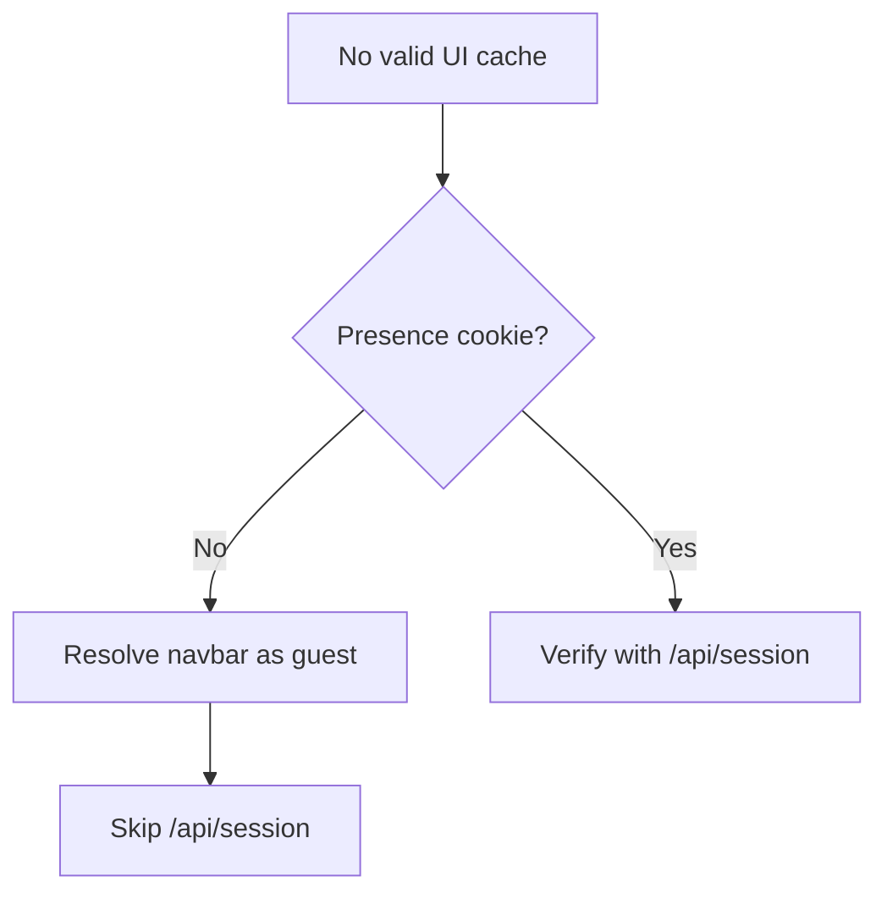
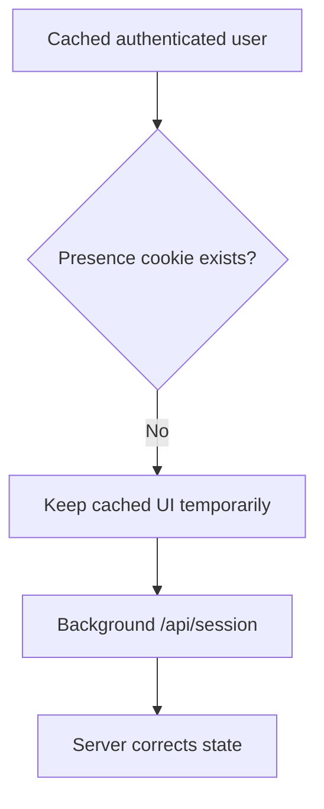
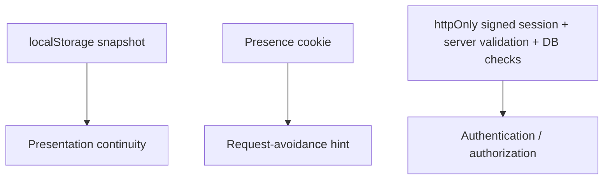

# Reducing Anonymous Session Requests Without Weakening Authentication

[Back to Engineering Case Studies](./README.md)

KK Archive serves both anonymous visitors and authenticated users.

The navigation bar needs to decide whether to show guest actions such as Login/Register or authenticated actions such as Profile, Logout, and staff/admin links.

A simple implementation is to call `/api/session` whenever the navigation component needs to resolve authentication state.

Functionally, that works.

Operationally, it can be wasteful.

For a mostly public site, anonymous traffic should not repeatedly require server-side session resolution just so the UI can confirm:

> “This visitor is not logged in.”

## Existing UI Session Cache

Before this optimization, the navigation component already kept a local UI snapshot in `localStorage`.

The key is:

```text
kk_site_nav_session_v1
```

The cache intentionally uses different lifetimes:

```text
Authenticated user: 15 minutes
Anonymous guest:    30 seconds
```

The purpose is to avoid fetching `/api/session` repeatedly during the same browsing flow and to reduce navbar flicker while authentication state is being resolved.

However, because guest state expires much sooner, anonymous visitors are more likely to fall back to another server request after the snapshot becomes stale.

That exposed the underlying question:

> **Can clearly anonymous traffic avoid session verification entirely, without weakening the authentication model?**

## The Security Constraint

The real session cookie cannot simply be exposed to JavaScript.

KK Archive's authenticated session cookie remains:

```text
httpOnly: true
```

The server-side session implementation validates the signed payload, expiration, database user record, role, and suspension state before accepting the session.

Making that cookie client-readable simply to save an API call would weaken the trust boundary.

So the optimization needed a second signal that could be visible to the browser without containing authentication data.

## Adding a Presence Hint

I added a separate cookie:

```text
kkd_session_present=1
```

This cookie is intentionally readable by JavaScript.

But its value is deliberately meaningless from an authorization perspective.

It contains no:

- user ID;
- email;
- role;
- session payload;
- session signature.

It only means:

> **“A real session may exist.”**

The actual session cookie remains separate and `httpOnly`.

The implementation reflects that distinction directly: the main session cookie is configured as `httpOnly: true`, while the presence cookie is configured as client-readable.

## New Anonymous Flow

The navigation component now checks the presence hint before deciding whether server verification is needed.

For a clearly anonymous visitor:



This removes an unnecessary network request and avoids server-side session/database work for visitors who are already clearly anonymous.

## Authenticated Flow Still Uses the Server

When the presence cookie exists, the client is allowed to call `/api/session`.

But the presence cookie itself is never trusted.

```mermaid
flowchart TD
    A[Presence hint] --> B[/api/session]
    B --> C[Read real httpOnly session cookie]
    C --> D[Verify HMAC signature]
    D --> E[Check expiration]
    E --> F[Load database user]
    F --> G[Check suspension / role]
    G --> H[Return verified user]
```

The session route also remains explicitly non-cacheable with `Cache-Control: no-store`.

This preserves the key rule:

> **Client-readable state may decide whether verification is worth attempting, but it never proves authentication.**

## Keeping Login and Logout in Sync

The presence hint is synchronized with actual authentication events.

After a successful Google OAuth callback, the server writes both:

- the real authenticated session cookie;
- `kkd_session_present=1`.

On logout, both cookies are deleted.

The navigation's cached UI session is also cleared so that presentation state does not remain stale after logout.

This leaves three related but distinct layers:

```text
LocalStorage snapshot
→ UI continuity

Presence cookie
→ request optimization hint

httpOnly session
→ authentication source
```

## Handling an Inconsistent Browser State

One edge case required a more conservative approach.

Suppose the browser has a cached authenticated user in `localStorage`, but the new presence cookie is missing.

Immediately treating that state as logged out could be wrong.

This can happen because of situations such as:

- an older session created before the presence-cookie mechanism existed;
- cookie domain/path differences;
- temporary browser-state mismatch.

The component therefore keeps the cached user visible temporarily and starts a background `/api/session` check instead of immediately flashing the navbar to guest state.



The local snapshot therefore improves presentation continuity, but it never becomes an authentication source.

## Stale Presence Cookies Fail Safely

The opposite inconsistency can also occur:

```text
Presence cookie exists
but
real session is invalid or expired
```

In that situation, the worst outcome is one unnecessary `/api/session` request.

The server still validates the actual signed session. If no valid user exists, `/api/session` returns `user: null` and removes the stale presence cookie.

A forged or stale `kkd_session_present=1` cannot log anyone in. It can only cause the server to perform verification.

## Authorization Remains Independent from the Navbar

The navbar is a presentation layer.

Showing an Admin or staff link is not authorization.

Protected server-side flows continue to use the real session validation functions such as:

```text
requireAdmin()
requireStaff()
```

These depend on the signed session and database user/role checks.

As a result, manually modifying `localStorage`, the presence cookie, or client-side navbar state cannot grant privileged access.

## Verification

I verified the main state transitions around the change:

- **Anonymous browsing:** no presence cookie → resolve as guest → no `/api/session` request.
- **Google login:** OAuth callback → create real session cookie → create presence cookie.
- **Logout:** delete real session cookie → delete presence cookie → clear cached navbar state.
- **Refresh after login:** presence hint exists → `/api/session` can revalidate the user.
- **Expired or invalid session:** `/api/session` → `user: null` → remove presence hint.
- **Admin / Audit access:** navbar is UI convenience; `requireAdmin` / `requireStaff` remain the actual gatekeepers.

## Result

I did not retain a formal before-and-after request count for this optimization, so I do not claim a percentage reduction.

The behavioral outcome is directly verifiable:

> **Clearly anonymous visitors no longer need to call `/api/session` simply to resolve navbar authentication state.**

Authenticated users still go through the existing server verification flow.

The optimization therefore reduced unnecessary server work without transferring authentication authority into browser-readable state.

## What I Learned

The key design distinction was between:

> **a hint that authentication verification may be necessary**

and

> **proof that authentication has succeeded**

Those are not the same thing.



That separation made it possible to optimize anonymous traffic without weakening the real security boundary.

## Evidence

- [Optimization commit — `127bbb5`: Reduce anonymous session checks](https://github.com/Mmc1xs/KK-Archive/commit/127bbb5ef525d5173e5a45a2e3a94d4d39fd508b)
- [Navigation implementation at the optimization commit](https://github.com/Mmc1xs/KK-Archive/blob/127bbb5ef525d5173e5a45a2e3a94d4d39fd508b/components/site-nav-client.tsx)
- [Session implementation at the optimization commit](https://github.com/Mmc1xs/KK-Archive/blob/127bbb5ef525d5173e5a45a2e3a94d4d39fd508b/lib/auth/session.ts)
- [Session API at the optimization commit](https://github.com/Mmc1xs/KK-Archive/blob/127bbb5ef525d5173e5a45a2e3a94d4d39fd508b/app/api/session/route.ts)
- [Google OAuth callback at the optimization commit](https://github.com/Mmc1xs/KK-Archive/blob/127bbb5ef525d5173e5a45a2e3a94d4d39fd508b/app/auth/google/callback/route.ts)
- [Logout route at the optimization commit](https://github.com/Mmc1xs/KK-Archive/blob/127bbb5ef525d5173e5a45a2e3a94d4d39fd508b/app/auth/logout/route.ts)
- [KK Archive repository](https://github.com/Mmc1xs/KK-Archive)
