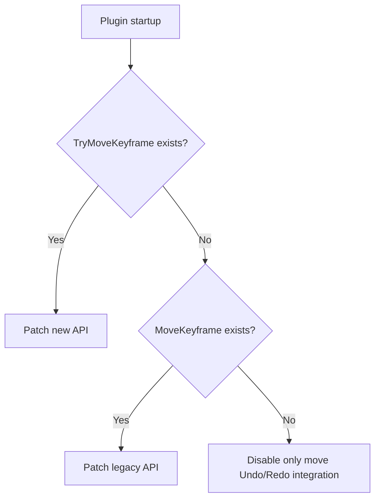
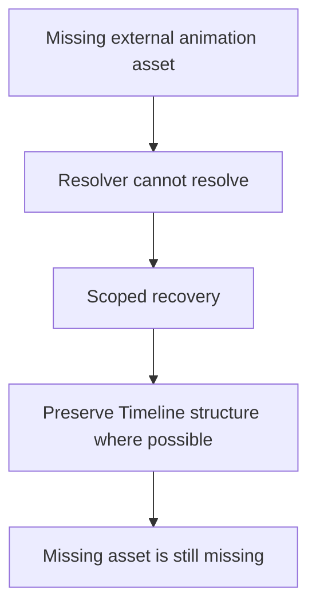
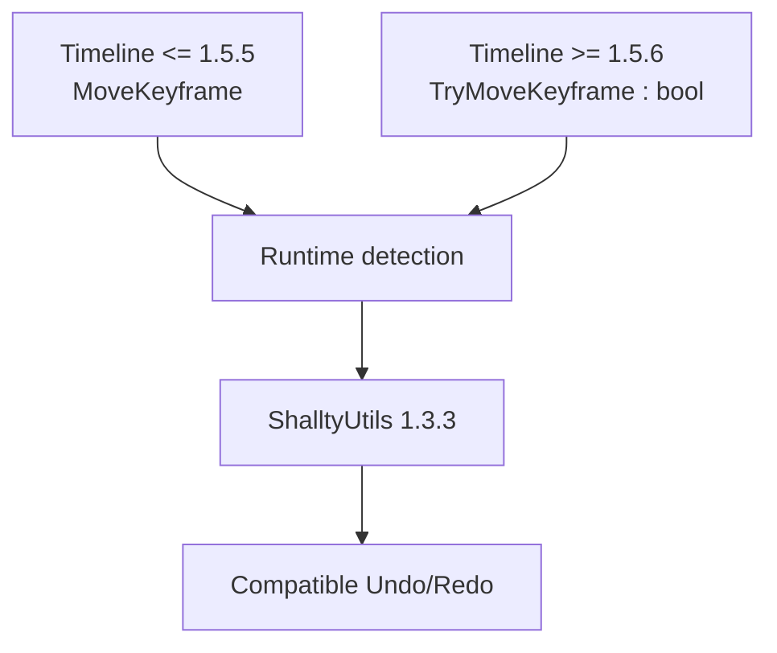

# Maintaining a Compatibility Fork After an Upstream API Breaking Change

[Back to Engineering Case Studies](./README.md)

ShalltyUtils is a Koikatsu / Studio utility plugin that extends Timeline workflows, including Undo/Redo integration around keyframe operations.

I maintain a compatibility fork of the project because a breaking change in Timeline 1.5.6 caused the original integration to fail on newer versions.

The original ShalltyUtils implementation patched:

```text
Timeline.Timeline.MoveKeyframe(Keyframe, float)
```

Timeline 1.5.6 changed that API to:

```text
Timeline.Timeline.TryMoveKeyframe(Keyframe, float) : bool
```

Because the original method no longer existed, Harmony could no longer resolve the expected patch target during plugin startup.

The initial compatibility problem looked simple, but the correct solution required more than renaming a method.

## Why Replacing the Method Name Was Not Enough

A direct migration from `MoveKeyframe(...)` to `TryMoveKeyframe(...)` would make the plugin compatible with Timeline 1.5.6.

However, it would also make the fork incompatible with Timeline 1.5.5 and older versions, which still expose the legacy `MoveKeyframe` API.

The real requirement was therefore:

> **Support the new upstream API without abandoning existing users on older versions.**

The fork solves this by detecting the available method at runtime rather than compiling the integration around only one Timeline version.

## Runtime API Detection

At plugin startup, the compatibility layer checks which Timeline API is available.



The behavior is:

- if `TryMoveKeyframe(Keyframe, float)` exists, patch the Timeline 1.5.6+ method;
- otherwise, if `MoveKeyframe(Keyframe, float)` exists, fall back to the legacy implementation;
- if neither method exists, disable only the keyframe-move Undo/Redo integration instead of failing the entire plugin.

This allowed one compatibility fork to handle both API generations without modifying `Timeline.dll`.

## The API Change Also Changed Behavior

The new API was not simply a renamed function.

`TryMoveKeyframe` returns a `bool` which indicates whether the move actually succeeded.

That changes the semantics of the integration.

For example, Timeline may reject a keyframe move when the destination conflicts with an existing keyframe.

With the older assumptions, the plugin could incorrectly record an Undo/Redo command even though Timeline had rejected the move.

```text
Plugin history:
"Keyframe moved"

Actual Timeline state:
"Move rejected"
```

The compatibility fork therefore records the Undo/Redo operation only when the new API returns success.

```csharp
if (__result && undoRedoTimeline.Value && !float.IsNaN(__state))
{
    // record move command
}
```

The maintenance task was not merely “update the method call.” It was to understand the changed contract and preserve the behavior of the integration.

## Defensive Undo/Redo Handling

The same compatibility update also added defensive handling around keyframe operations.

The fork documents protections for cases such as:

- missing keyframes;
- destination-time collisions;
- rejected keyframe moves.

These edge cases matter because Undo/Redo systems depend on the command history matching the real application state.

If an operation fails but still enters the history, later Undo or Redo operations can attempt to manipulate state that was never created.

The goal was therefore not only to make ShalltyUtils load successfully, but to prevent compatibility changes from introducing invalid history state.

## Testing Revealed a Second Failure Path

While testing the compatibility fork with Timeline 1.5.6, I encountered a separate scene-loading problem.

Timeline's built-in `charAnimation` interpolable can use:

```text
Sideloader.AutoResolver.UniversalAutoResolver.GetStudioResolveInfos(...)
```

when resolving animation metadata.

For some scenes, or when required Sideloader animation data is missing, that resolver can return `null`.

Timeline then performs LINQ operations against the missing result, causing a `NullReferenceException`.

The affected `charAnimation` interpolable can then be discarded while the scene is being loaded.

This was unrelated to the keyframe API rename, but it appeared during the same compatibility testing process and affected the reliability of newer Timeline environments.

## Using a Narrow Recovery Boundary

A broad exception handler would have been dangerous.

Silently swallowing every Timeline exception could hide unrelated bugs and make debugging more difficult.

Instead, the fork adds a narrowly scoped Harmony finalizer only when the affected interpolable matches:

```text
owner="Timeline"
id="charAnimation"
```

If the known resolver failure occurs while reading the relevant animation XML, the fork reconstructs a safe fallback value so Timeline can continue loading the interpolable rather than discarding it entirely.

A corresponding recovery path also exists when writing `charAnimation` XML.

The design goal is:

> **Recover from one understood failure mode without masking unrelated errors.**

## Recovery Has an Explicit Limit

The recovery logic does not pretend to restore data that does not exist.

If a scene depends on:

- a missing zipmod;
- a missing custom animation;
- unavailable Sideloader assets;

the fork cannot recreate those assets.

Instead, it prevents missing resolver data from causing Timeline to discard the entire `charAnimation` interpolable.



A defensive fallback should preserve recoverable state, but it should not claim to repair external data that is genuinely unavailable.

## Making the Compatibility Path Observable

The fork identifies itself as **Shallty Utils 1.3.3** to make the compatibility build distinguishable in logs.

On Timeline 1.5.6+, the expected log includes:

```text
Timeline keyframe move compatibility mode: TryMoveKeyframe
```

On older Timeline versions:

```text
Timeline keyframe move compatibility mode: MoveKeyframe
```

This makes the runtime decision observable rather than silently choosing a compatibility path.

## Result



At the same time, the fork also adds targeted recovery for known `charAnimation` resolver failures and defensive handling around failed keyframe operations.

The compatibility work is contained in the plugin itself and does not require modifying the upstream `Timeline.dll`.

## Why This Matters Beyond This Plugin

The specific technologies here are C#, Harmony, Timeline, and BepInEx.

But the engineering problem is broader.

An upstream dependency changed its public contract.

That required answering several questions:

```text
What exactly changed?
        ↓
Is the change only syntactic?
        ↓
Did behavior change too?
        ↓
Can legacy and new versions coexist?
        ↓
What should happen on failure?
        ↓
Can recovery be scoped safely?
```

Those questions apply to many types of integration work: APIs, browser behavior, external services, libraries, parsers, and third-party systems.

The important part was not knowing the new method name.

It was being able to investigate an unfamiliar dependency, understand its new behavior, and adapt an existing integration without unnecessarily breaking older environments.

## What I Learned

This maintenance work reinforced that compatibility engineering is different from ordinary feature development.

When working with an external dependency, I do not control when its API changes.

A robust maintenance approach therefore needs to account for:

- multiple upstream versions;
- changed return semantics;
- partial failure;
- missing external data;
- backward compatibility;
- observable diagnostics;
- explicit recovery limits.

The resulting solution combined:

> **runtime detection + semantic adaptation + backward compatibility + defensive recovery**

rather than assuming that one dependency version would remain stable.

## Evidence

- [ShalltyUtils compatibility fork](https://github.com/Mmc1xs/ShalltyUtils)
- [Compatibility README at the compatibility commit](https://github.com/Mmc1xs/ShalltyUtils/blob/62959e4b5789163075830cf9614b32ee1e4acea5/README.md)
- [Compatibility commit — `62959e4`: Fix Timeline 1.5.6 compatibility](https://github.com/Mmc1xs/ShalltyUtils/commit/62959e4b5789163075830cf9614b32ee1e4acea5)
- [Runtime compatibility implementation at the compatibility commit](https://github.com/Mmc1xs/ShalltyUtils/blob/62959e4b5789163075830cf9614b32ee1e4acea5/ShalltyUtils.Core/ShalltyUtils.Hooks.cs)
